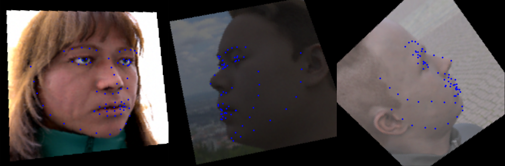
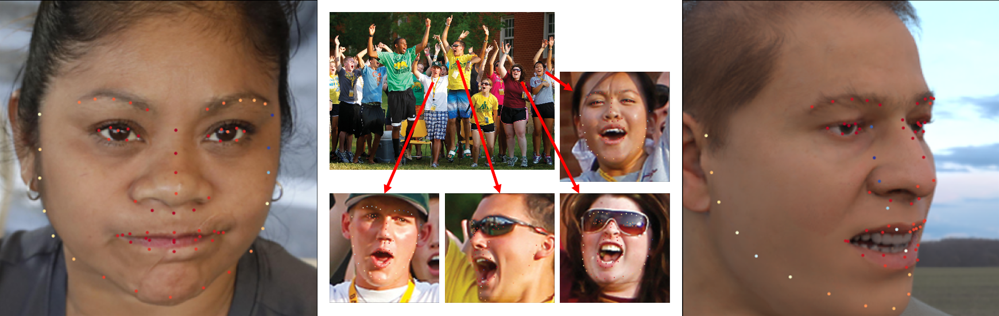
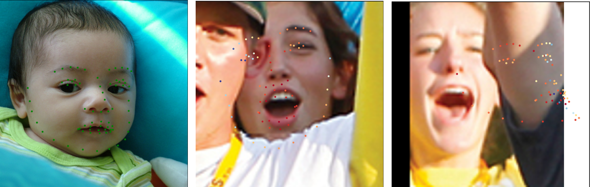

# 3D Landmark Detection Module (Pytorch)

- Validation results:


The module for "3D" landmark detection(Look at the chin in the figure above) using the model trained with synthetic data. Because this is not a "2D" detection, it even predicts the opposite side of the face. This project is inspired by these two MicroSoft papers: Dataset and Overall pipeline from [this one](https://microsoft.github.io/FaceSynthetics/) and GNLL Loss from [this one](https://microsoft.github.io/DenseLandmarks/)

Note: I only conducted a shallow parameter search. Therefore, it may not be the module that produces the best performance. Please find parameters that make it better

-----------------

# Simple usage(Inference):

### 1. Download the pretrained weights from [Here](https://drive.google.com/drive/folders/1UvIamKlHrFx8sPeQBwvKkAK3xZ7j19j9?usp=sharing)

### 2. Put downloaded pretrained weights at ```<module_path>/pretrained/``` 

### 3. Put your test image at ```<module_path>/test_image/```

(The size of test images should be bigger than 512x512)

### 4. Inference

Take these example commands written below:

```.bash
#General command
python test.py --datasetPath <test dataset directory> --pretrained <pretrained weight path>\
    --saveDir <directory for saving test results> --gpu <gpu number>\
    --IsGNLL <whether to use models trained with GNLL loss(boolean, default=False)>\
    --modelType <modelType(ResNet34 or MoblieNetv2)>

# Using ResNet34 model trained with MSE loss
python test.py --pretrained your_path/resNet_MSE_120epoch.pt

# Using ResNet34 model trained with GNLL loss
python test.py --pretrained your_path/resNet_GNLL_120epoch.pt --IsGNLL True

# Using MoblieNetv2 model trained with MSE loss
python test.py --pretrained your_path/moblieNet_MSE_120epoch.pt --modelType MoblieNetv2

# Using MoblieNetv2 model trained with GNLL loss
python test.py --pretrained your_path/moblieNet_GNLL_120epoch.pt --IsGNLL True --modelType MoblieNetv2
```

### 5. The results will save in ```<module_path>/test_result/```

-----------------

# Inference in code

### You can also access it at the code level like this:

```python

import test as T

module = T.test_module(datasetPath = None, pertrained = './pretrained/model_26.pt', \
                        saveDir = './test_result', IsGNLL = False, modelType = 'ResNet34')
# pred_ladmks = [[x1,y1],[x2,y2]...]

info_1 = module.inference_imgFolder(your_img_folder)
'''info_1 - landmarks information of images in your_img_folder:
[
    [
        [pred_ladmks(2D array)], 
        [pred_ladmks],
        ... ],
    [
        [pred_ladmks], 
        [pred_ladmks],
        ... ]
                ]
'''

info_2 = module.inference_imgPath(your_img_path)
'''info_2 - landmarks information for an image of your_img_path:
[
    [pred_ladmks(2D array)], 
    [pred_ladmks],
    ... ] 
'''

info_3 = module.inference_img(your_img) #input: PIL image
'''info_3 - a predicted landmark(2D array): 
[[x1,y1],[x2,y2]...]
'''

```

-----------------

# Training the model:

### 1. Download the dataset from [Here](https://github.com/microsoft/FaceSynthetics)

### 2. Make bounding box for training:

#### 2.1 Make new directory named ```bbox_leftcorner_coord``` for saving bounding box coordinate in your ```your_dataset/```

#### 2.2 Put this command on your prompt 

```
python Make_Bbox.py --datasetPath <directory of images>
```
#### 2.3 The information of the bounding box will be processed 

(Note: Among the 100,000 images, 385 images were not recognized. These images were treated as center crop)

### 3. Training

Take these example commands written below:

```.bash
#General command
python train.py --name <name of the experiment> --datasetPath <test dataset directory>\
    --saveDir <directory for saving logging> --gpu <gpu number>\
    --numEpoch <the number of epoch> --batchSize <batch size>\
    --lr_landmark <learning rate> --print_interval <the interval of the printing log>\
    --IsGNLL <whether to use models trained with GNLL loss(boolean, default=False)>\
    --modelType <modelType(ResNet34 or MoblieNetv2)> --IsAug <whether to use augmentation(boolean, default=True)>

# Train with ResNet34 model and MSE loss
python train.py --name <name of the experiment> --saveDir <directory for saving test results>

# Train with ResNet34 model and GNLL loss
python train.py --name <name of the experiment> --saveDir <directory for saving test results>\
                --IsGNLL True

# Using MoblieNetv2 model trained with GNLL loss
python train.py --name <name of the experiment> --saveDir <directory for saving test results>\ 
                --modelType MoblieNetv2

# Using MoblieNetv2 model trained with MSE loss without data augmentation
python train.py --name <name of the experiment> --saveDir <directory for saving test results>\
                --modelType MoblieNetv2 --IsAug False
```

### 4. The log(model, loss, validation) will save in ```saveDir/```

-----------------

# Visualization

You can make visualization from the predicted landmarks and test figure.

The visualization function is placed in ```visualization.py```. Check ```def save_result``` and ```def save_result_std``` of it. Or you can make the visualzation figure with by ```python visualization.py```. See the ```if __name__ == "__main__":``` of ```visualization.py```

You can also make visualization from test module like:

```python
import test as T

module = T.test_module(datasetPath = None, pertrained = './pretrained/model_26.pt', \
                        saveDir = './test_result', IsGNLL = False, modelType = 'ResNet34')
                        
path = "./test_image/FFHQ00002.png"
img = Image.open(path)
img = img.resize((256, 256))

pred_ldmks = test_class.inference_img(img)
#MSE model
test_class._save_result(img, np.expand_dims(pred_ldmks, axis = 0), "_save_result_std", 0)
#GNLL model
test_class._save_result_std(img, np.expand_dims(pred_ldmks, axis = 0), "_save_result_std", 0)

```
-----------------

# Result

Here is some good result of our module. Check ```test_image/``` and ```test_result/``` for the original image and more results.
(The color of the landmark indicates confidence - the model trained by GNLL loss)



-----------------

# Limitation

Unfortunately, this module is not perfect. Here are some examples of failures. In my opinion, the reasons for failure are: first, out of the dataset (baby face, leftmost), second, face occlusion(middle), and third, face recognition or alignment failure(rightmost).



-----------------

# Reference

[Fake It Till You Make It Face analysis in the wild using synthetic data alone (ICCV2021)](https://microsoft.github.io/FaceSynthetics/)

[3D Face Reconstruction with Dense Landmarks (ECCV 2022)](https://microsoft.github.io/DenseLandmarks/)

[RetinaFace](https://github.com/serengil/retinaface) for making bounding box

-----------------

# MEMO

pip install pandas

pip install natsort

pip install retina-face

pip install "opencv-python-headless<4.3"


